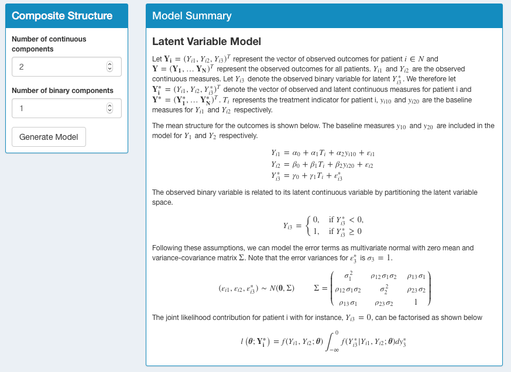
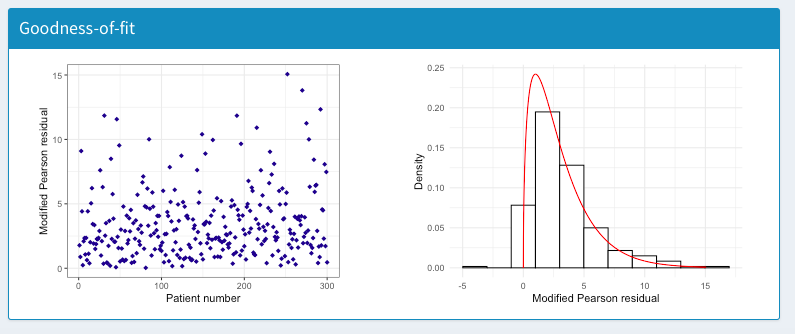

```{r setup, include=FALSE}
knitr::opts_chunk$set(echo = TRUE)
```

## AugBin tutorial 

The tutorial on this page uses an example dataset to provide step-by-step guidance for using the AugBin Shiny app to analyse mixed outcome continuous and discrete composite responder endpoints. In the case that further queries arise about the functionality of the app for specific applications, contact Martina McMenamin at <martina.mcmenamin@mrc-bsu.cam.ac.uk>.

For illustration we use a simulated dataset where the composite endpoint is comprised of one continuous and one binary outcome. An important first step before employing the app is to have the dataset in the correct format. The columns should be organised as follows:

* patient ID 
* treatment allocation
* Observed continuous outcome measure(s) (may be one or two depending on the composite endpoint)
* Observed binary measure (if it exists)
* Observed continuous baseline measure(s) 

After uploading the data, the raw data table will displayed as shown.
<br>

```{r,echo=FALSE,out.width="70%"}

```
<br><br>  
The raw data can then be visualised by group using a boxplot, histogram, density, bar graph or violin plot, depending on the outcome type. The example below shows a boxplot of the continuous outcome variable $Y_{1}$ by treatment arm. The raw data points may be included or excluded from the plots as shown.

```{r,echo=FALSE,out.width="33%"}
knitr::include_graphics(c("SS2.png","SS3.png","SS4.png"))
```
<br><br>  
The 'Composite Structure' panel allows the user to select the number of continuous and binary outcomes that make up the composite endpoint. This may be one or two continuous measures and zero or one binary measures. Note that the composite may include any number of discrete variables however these must be combined to a single binary discrete response indicator. Additional continuous measures may also be incorporated in this way. 

'Generate Model' will show the corresponding model fitted, which is shown below for this example. For further information on the model and how the probability of response and standard errors are obtained see <https://arxiv.org/abs/1902.07037>. 

```{r,echo=FALSE,out.width="60%"}

```
<br><br>  
When the composite combines any mixture of continuous and discrete components the latent variable model is used. For two continuous and one binary it takes the form shown below.

```{r,echo=FALSE,out.width="60%"}

```
<br><br>
If the composite is comprised only of continuous measures a normal distribution of the appropriate dimension is assumed. 

```{r,echo=FALSE,out.width=c("55%","55%")}


```
<br><br>  
The Analysis tab follows which allows the user to enter the dichotomisation threshold for the continuous components. The input depends on the structure selected as shown.

```{r,echo=FALSE,out.width=c("12%","40%"),fig.show='hold'}
knitr::include_graphics(c("SS13.png","SS13a.png"))
```

```{r,echo=FALSE,out.width=c("12%","40%"),fig.show='hold'}
knitr::include_graphics(c("SS14.png","SS14a.png"))
```

<br><br>
Clicking the 'Run Analysis' button starts the analysis. This stage involves the following steps:

* The model is fit and maximum likelihood parameter estimates are obtained
* The covariance matrix of the parameter estimates is obtained by inverting the Hessian
* Numerical integration is implemented to obtain the probability of response in each arm
* Treatment effects in the form of the log-odds ratio, log-risk ratio and risk difference are calculated
* Partial derivatives of the treatment effect estimates with respect to the parameter estimates are computed
* Standard error estimates for the treatment effect estimates are obtained using the delta method 
* These are used to give 95% confidence intervals
* A logistic regression model on the overall response endpoint is implemented for comparison (Standard Binary method)

This process may take anywhere between a few seconds and a few minutes depending on the complexity of the endpoint. A loading bar will show to indicate when the analysis is still running and if any errors occur then they will be displayed in the Analysis panel. The output is as shown below where the probability of response in each arm for both methods is shown in a table. The plots indicate the treatment effect point estimates and 95% confidence intervals. Note that the improvement in efficiency from the augmented approach depends on the response in each arm and the dichotisation threshold, as illustrated.

```{r,echo=FALSE,out.width=c("45%","45%")}
knitr::include_graphics(c("SS9.png","SS10.png"))
```
<br><br>
The continuous outcome data may be transformed using a Box-Cox transformation, more details of which are available at <https://doi.org/10.1111/j.2517-6161.1964.tb00553.x>. This is achieved by using the selection shown below and executed using the 'Run Analysis' button. 

```{r,echo=FALSE,out.width="60%"}

```
<br><br>
The final panel shows the goodness-of-fit for the model fitted in the augmented approach. This is evaluated using modified Pearson residuals, which are shown in the left hand plot. The right hand plot shows the density of the residuals which should follow a $\chi^{2}$ distribution if the model is a good fit.  

```{r,echo=FALSE,out.width="60%"}

```

This tutorial has illustrated the functionality of AugBin for one example. For more information on the methods go to <https://arxiv.org/abs/1902.07037> or to obtain the underlying R code, visit <https://github.com/martinamcm/Complex-Composite-Endpoints>. For any further queries email <martina.mcmenamin@mrc-bsu.cam.ac.uk>. 
